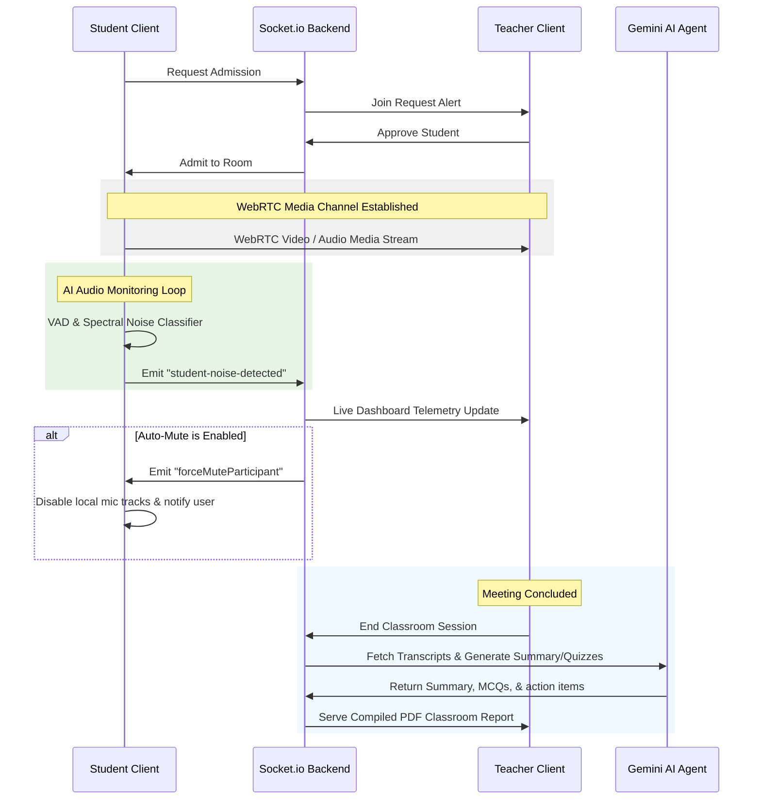

# 🎓 SmartClass AI

SmartClass AI is an AI-powered virtual classroom platform featuring real-time video conferencing, a full WebRTC communication grid, and an **Agentic AI Teaching Assistant**. The platform continuously analyzes student engagement, tracks attendance, transcribes classroom discussions, and automatically moderates disruptive background noise to protect the learning environment.

---

## 🛠️ Technology Stack

| Component | Technology | Description |
| :--- | :--- | :--- |
| **Frontend Framework** | React v18 | Component-based interactive UI library |
| **Build Tooling** | Vite v5 | Hyper-fast dev server and bundle pipeline |
| **Backend Framework** | Node.js + Express v4 | REST API routing and middleware |
| **Real-Time Data** | Socket.IO v4 | Bidirectional WebSocket messaging |
| **Real-Time Media** | WebRTC | Peer-to-peer audio and video transmission |
| **Database** | Supabase (PostgreSQL) | Managed database backend |
| **Authentication** | JWT + PBKDF2 | Token-based sessions with hashed passwords |
| **AI Processing** | Google Gemini AI | LLM integration (`gemini-1.5-flash`) |
| **Styling** | Vanilla CSS | Custom fluid designs and responsive dark mode |
| **Programming Language** | TypeScript v5 | Type-safe JavaScript |
| **Package Manager** | npm | Dependency resolution and scripts |

---

## 🚀 Features

*   🔒 **Secure Authentication**: Register and log in with JWT-based state management, with distinct **Teacher** and **Student** roles.
*   🏫 **Classroom Lobby**: Create classes with custom titles (Teachers) or request access via room codes (Students).
*   🚪 **Admissions Waiting Room**: Student entrance requests are held in a waiting room queue until approved or rejected by the teacher.
*   📺 **Full-Mesh WebRTC Calling**: Peer-to-peer real-time video and bidirectional high-quality audio transmission.
*   💬 **Real-Time Classroom Chat**: Text channel communication synced instantly via WebSockets.
*   ✋ **Raise Hand & Emoji Reactions**: Visual telemetry indicators and interactive overlays for classroom participation.
*   🎙️ **Live Speech-to-Text**: Client-side speech recognition capturing transcripts dynamically.
*   📊 **Live AI Dashboard**: Host-only control panel detailing real-time attendance status, questions asked, raised hands, and continuous transcripts.
*   🚨 **VAD & Noise Classification**: Real-time spectral analyser distinguishing speech from disruptive background noises (fan, music, TV, barking, typing).
*   🔇 **Automated AI Auto-Mute**: If configured by the teacher, the AI automatically mutes students generating high-severity noise to maintain room acoustics.
*   📝 **Post-Class Performance Report**: Structured summaries, timeline events, engagement stats, transcripts, and auto-generated quizzes compiled at meeting conclusion.
*   📄 **PDF Export**: Print-ready, structured classroom reports downloadable with one click.

---

## 📐 System Architecture

The following diagram illustrates the flow of real-time communication, telemetry events, and AI moderation loops:



---

## 📂 Folder Structure

```
/AgenticAi
  ├── /backend
  │     ├── package.json          (Backend configuration)
  │     ├── tsconfig.json         (TypeScript configuration)
  │     ├── server.ts             (Express & Socket.io server bootloader)
  │     ├── database.json         (Resilient offline local database fallback)
  │     └── /src
  │           ├── db.ts           (Supabase connection pool and tables migrations)
  │           ├── auth.ts         (Hashed credentials & JWT generator)
  │           ├── routes.ts       (REST endpoints routing & authorization)
  │           ├── socket.ts       (WebSockets handlers & WebRTC signaling)
  │           └── agents.ts       (Cooperating AI agents logic)
  ├── /frontend
  │     ├── package.json          (Frontend configuration)
  │     ├── vite.config.ts        (Vite configuration with proxy rules)
  │     ├── index.html            (HTML main entry)
  │     └── /src
  │           ├── main.tsx        (React mount helper)
  │           ├── App.tsx         (Classroom router and view controller)
  │           ├── index.css       (Vanilla CSS variables, animations, grids)
  │           ├── /components
  │           │     ├── Auth.tsx         (Login and registration forms)
  │           │     ├── GreenRoom.tsx    (Device toggles and join waiting room)
  │           │     ├── Classroom.tsx    (Main classroom calling grid)
  │           │     ├── AIPanel.tsx      (Teacher telemetry & noise controls)
  │           │     └── ReportView.tsx   (Post-class analytics report and PDF downloader)
  │           └── /hooks
  │                 ├── useWebRTC.ts     (WebRTC full-mesh multi-peer hook)
  │                 └── useAudio.ts      (VAD, speech recognition, and classifier)
```

---

## ⚙️ Environment Variables

Create a `.env` file in the `/backend` folder. Use the template below:

```env
# Server Port Configuration
PORT=5000

# JWT Auth Secret Key
JWT_SECRET=your_custom_secure_jwt_secret_key_string

# Supabase Postgres Database Credentials
SUPABASE_URL=https://your-project-ref.supabase.co
SUPABASE_KEY=your-supabase-service-role-key-containing-db-password

# Google Gemini API Key (Optional: Falls back to rule-based summary parser if unset)
GEMINI_API_KEY=AIzaSyYourGeminiApiKeyHere
```

---

## 📋 Database Schema

When the backend server starts, it automatically executes migration statements to compile the schema below in Supabase:

*   **`users`**: User records containing role details (`teacher` or `student`) and PBKDF2-hashed passwords.
*   **`meetings`**: Session IDs, titles, host assignments, and classroom lock statuses.
*   **`participants`**: Live rosters with status updates (`waiting`, `admitted`, `rejected`), media configurations, and hand-raise telemetries.
*   **`attendance`**: Entry times, disconnects, total active durations, and attendance categorizations (`present`, `late`, `left_early`).
*   **`chat_messages`**: Chat logs stored per room.
*   **`noise_events`**: Noise logs mapping occurrences, types, and warnings/mute histories.
*   **`participation_metrics`**: Aggregated engagement indicators (chat logs, speaking durations, questions, hands) mapped to calculate participation scores.
*   **`transcripts`**: Dynamic Speech-to-Text transcript lines.
*   **`ai_analytics`**: Intermediate session parameters updated during calls.
*   **`reports`**: Classroom data summaries, generated homeworks, quiz answers, and session diagnostics.
*   **`questions_answers`**: Interactive database logs matching questions asked during classrooms.
*   **`meeting_timeline`**: Event timeline feeds detailing classroom logs.

---

## 🧠 AI Agentic Architecture

SmartClass AI implements an agentic design comprising **8 cooperating virtual assistants** to manage classroom monitoring:

```
                  ┌──────────────────────────────┐
                  │      Classroom Session       │
                  └──────────────┬───────────────┘
                                 │
         ┌───────────────────────┼───────────────────────┐
         ▼                       ▼                       ▼
┌─────────────────┐     ┌─────────────────┐     ┌─────────────────┐
│  Noise Agent    │     │Attendance Agent │     │Speech Rec. Agent│
│    (Agent 1)    │     │    (Agent 3)    │     │    (Agent 4)    │
└────────┬────────┘     └────────┬────────┘     └────────┬────────┘
         │                       │                       │
         └───────────────────────┼───────────────────────┘
                                 ▼
                        ┌─────────────────┐
                        │Participation Agt│
                        │    (Agent 2)    │
                        └────────┬────────┘
                                 ▼
                        ┌─────────────────┐
                        │ Analytics Agent │
                        │    (Agent 6)    │
                        └────────┬────────┘
                                 ▼
                        ┌─────────────────┐
                        │  Teacher Panel  │
                        └────────┬────────┘
                                 │ (Class Ends)
         ┌───────────────────────┼───────────────────────┐
         ▼                       ▼                       ▼
┌─────────────────┐     ┌─────────────────┐     ┌─────────────────┐
│  Summary Agent  │     │   Quiz Agent    │     │  Report Agent   │
│    (Agent 5)    │     │    (Agent 7)    │     │    (Agent 8)    │
└─────────────────┘     └─────────────────┘     └─────────────────┘
```

1.  **Noise Detection Agent (Agent 1)**: Analyzes client mic inputs using Web Audio API nodes. Uses a frequency-distribution spectral classifier and dynamic VAD standard deviation limits. Identifies continuous noise (music, TV, canine barking, heavy machinery) and executes automated student client muting.
2.  **Participation Agent (Agent 2)**: Aggregates real-time speaking time, raised hand counts, chat logs, and answered questions to compute an active engagement percentage:
    $$\text{Engagement Score} = \text{Min}\left(100, (\text{speakingDuration} \times 0.4) + (\text{chatMessagesCount} \times 2.0) + (\text{handRaisesCount} \times 1.5) + (\text{responsesCount} \times 2.5)\right)$$
3.  **Attendance Agent (Agent 3)**: Logs session check-ins, disconnects, and early exits. Automates lateness categorization if joins exceed $5\text{ minutes}$ from host start.
4.  **Speech Recognition Agent (Agent 4)**: Listens to voice buffers on student/teacher clients using browser-level SpeechRecognition interfaces, uploading transcript packets directly to database lines.
5.  **Summary Agent (Agent 5)**: Resolves finished classroom session transcripts at class end using Gemini AI to generate a detailed summary, topics covered, and assignments.
6.  **Analytics Agent (Agent 6)**: Runs a 5-second calculation loop gathering live classroom telemetry to update the teacher's AI panel.
7.  **Quiz Agent (Agent 7)**: Examines parsed transcripts to generate a 3-question MCQ test with answers based on the topic discussed.
8.  **Report Agent (Agent 8)**: Joins outputs from Agents 2, 3, 5, and 7 to formulate a database report record, rendering print-ready PDFs using jsPDF.

---

## 🔒 Security Measures

*   **PBKDF2 Password Hashing**: Hashing algorithm utilizing crypto-generated salts before storing database records.
*   **HS256 JWT Token Verification**: Stateless login security storing authorization headers.
*   **Role-Based Security Routing**: Middleware blocks students from creating meetings or accessing classroom analytics and reports (`/reports/:meetingId` returns HTTP 403 Forbidden for students).
*   **Resilient Database Fallback**: If network restrictions block connections to the remote Supabase PostgreSQL instance, the server automatically bootstraps an offline JSON-based local database engine (`database.json`) to guarantee zero classroom downtime.

---

## 📡 API Documentation

### 1. User Authentications

#### Register Account
*   **Endpoint**: `POST /api/auth/register`
*   **Request Body**:
    ```json
    {
      "email": "teacher@email.com",
      "password": "securepassword",
      "name": "Prof. Smith",
      "role": "teacher"
    }
    ```
*   **Success Response (201 Created)**:
    ```json
    {
      "token": "eyJhbGciOi...",
      "user": {
        "id": "76ba3f5e-...",
        "email": "teacher@email.com",
        "name": "Prof. Smith",
        "role": "teacher"
      }
    }
    ```

#### Login Account
*   **Endpoint**: `POST /api/auth/login`
*   **Request Body**:
    ```json
    {
      "email": "student@email.com",
      "password": "studentpassword"
    }
    ```
*   **Success Response (200 OK)**:
    ```json
    {
      "token": "eyJhbGciOi...",
      "user": {
        "id": "e939d73d-...",
        "email": "student@email.com",
        "name": "Jane Doe",
        "role": "student"
      }
    }
    ```

### 2. Classroom Meetings

#### Create Meeting (Teachers Only)
*   **Endpoint**: `POST /api/meetings`
*   **Headers**: `Authorization: Bearer <token>`
*   **Request Body**:
    ```json
    {
      "title": "Introduction to WebRTC"
    }
    ```
*   **Success Response (201 Created)**:
    ```json
    {
      "meeting": {
        "id": "d3b07384-...",
        "host_id": "76ba3f5e-...",
        "title": "Introduction to WebRTC",
        "status": "scheduled",
        "scheduled_at": "2026-06-26T12:00:00Z"
      }
    }
    ```

#### Get Meeting Details
*   **Endpoint**: `GET /api/meetings/:meetingId`
*   **Headers**: `Authorization: Bearer <token>`
*   **Success Response (200 OK)**:
    ```json
    {
      "meeting": {
        "id": "d3b07384-...",
        "host_id": "76ba3f5e-...",
        "title": "Introduction to WebRTC",
        "host_name": "Prof. Smith",
        "status": "live",
        "scheduled_at": "2026-06-26T12:00:00Z"
      }
    }
    ```

### 3. Session Reports

#### Fetch Post-Class Report (Teachers Only)
*   **Endpoint**: `GET /api/reports/:meetingId`
*   **Headers**: `Authorization: Bearer <token>`
*   **Success Response (200 OK)**:
    ```json
    {
      "report": {
        "id": "84a77dfa-...",
        "meeting_id": "d3b07384-...",
        "summary": "Today's lecture introduced WebRTC full mesh architecture and signaling layers...",
        "topics": ["WebRTC Basics", "Signaling Servers", "STUN/TURN Servers"],
        "homework": ["Build a simple peer-to-peer data connection loop"],
        "action_items": ["Review MDN WebRTC APIs before next Tuesday"],
        "metrics": {
          "attendance": { "present": 4, "late": 1 },
          "noise_events": { "music": 1, "dog": 0 }
        }
      }
    }
    ```

---

## 🛠️ Installation & Setup

### 📋 Prerequisites
*   Node.js (v18 or higher)
*   Supabase Account or a local PostgreSQL database

### 1. Setup Backend
1. Navigate to backend:
    ```bash
    cd backend
    ```
2. Install npm dependencies:
    ```bash
    npm install
    ```
3. Configure environment parameters:
    Create a `.env` file inside `/backend` following the variables schema described in the [Environment Variables](#%EF%B8%8F-environment-variables) section.
4. Launch backend in development mode:
    ```bash
    npm run dev
    ```
    *The console should output: `🚀 Smart Classroom Backend listening on port 5000` along with PG pools or json fallbacks.*

### 2. Setup Frontend
1. Navigate to frontend:
    ```bash
    cd ../frontend
    ```
2. Install npm dependencies:
    ```bash
    npm install
    ```
3. Run Vite client server:
    ```bash
    npm run dev
    ```
4. Access the portal at `http://localhost:3000`.

---

## 🖼️ Screenshots

Below are screenshots demonstrating key screens inside the SmartClass AI platform:

### 1. Host DashBoard


### 2. Student DashBoard


### 3. Agent Work


### 4. Ai Analysis


### 5.Post Class Report


---

## 🔮 Future Roadmap

*   📈 **AI Emotion Recognition**: Analyze video frames locally using tfjs to evaluate general student confusion or attentiveness.
*   🌐 **Live Transcript Translation**: Provide real-time translated transcript lines to help multi-language student groups.
*   🤖 **AI Virtual Teaching Assistant**: Provide an in-call chatbot answering classroom-related student questions directly from the current transcript.
*   🧩 **Interactive Quiz Overlay**: Present real-time pop-up quiz forms to student clients during lectures.

---

## 🤝 Contributing

We welcome community contributions! Please open issues or submit pull requests.
1.  Fork the Project
2.  Create your Feature Branch (`git checkout -b feature/AmazingFeature`)
3.  Commit your Changes (`git commit -m 'Add some AmazingFeature'`)
4.  Push to the Branch (`git push origin feature/AmazingFeature`)
5.  Open a Pull Request

---

## 📄 License

Distributed under the MIT License. See `LICENSE` for more information.

---

## 👤 Author

*   **Name**: Devesh V
*   **GitHub**: [@deveshv](https://github.com/deveshv)
*   **LinkedIn**: [devesh-v](https://linkedin.com/in/devesh-v)
*   **Email**: [deveshv.cse@gmail.com](mailto:deveshv.cse@gmail.com)
